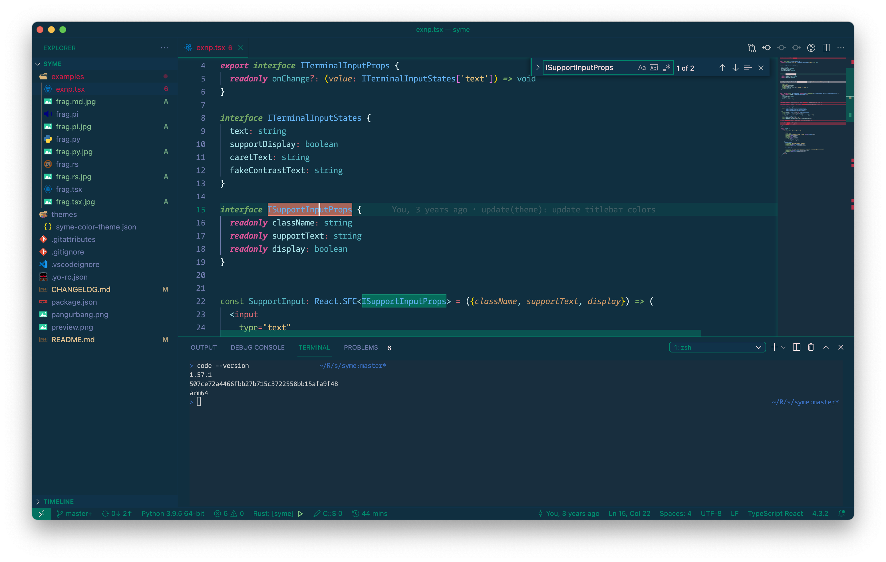

# syme

Based on monokai and maia.



## Editor Colors

```scss
$Themed-Decorator: #00896c;
$Basic-Background: #102f40;
$Basic-Text-Foreground: #a5dee4;
$Contrast-Black: #bbbbbb;
$Contrast-White: #fedfe1;
$Error-Scarlet: #cb1b45;
$Warning-Dirt: #f17c67;
```

## More Preview Code Snippets

### Python


### Rust


### TSX


